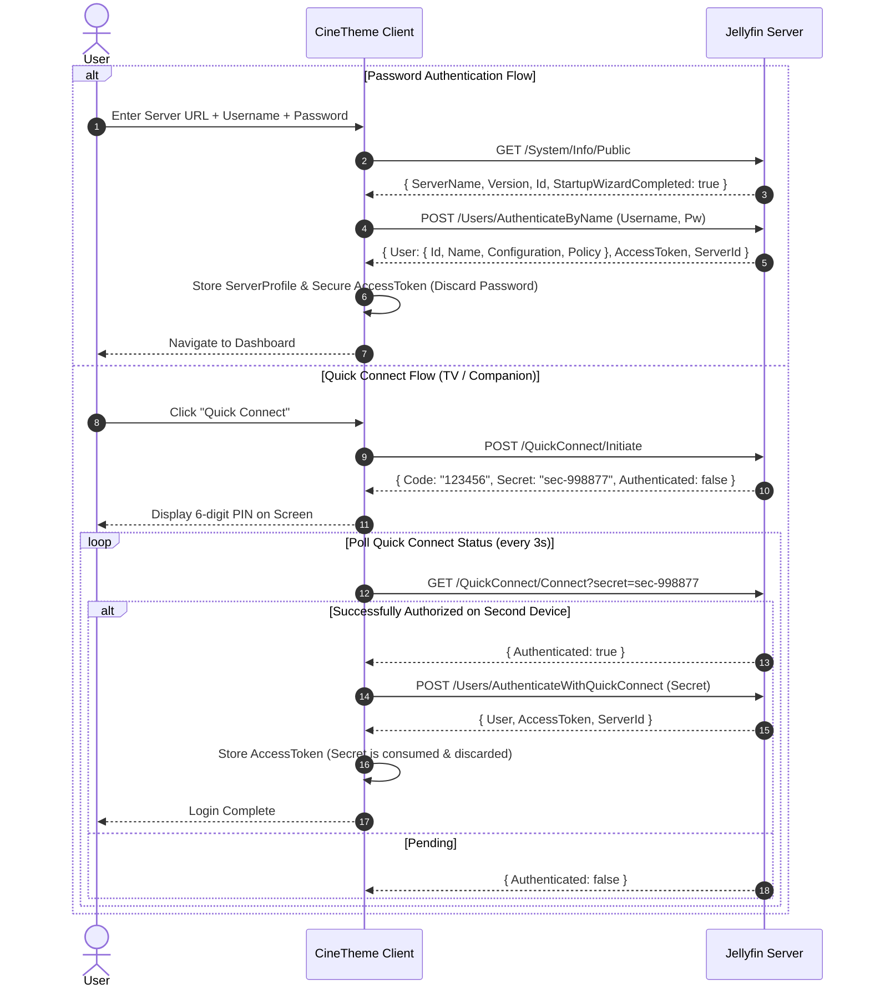

# CineTheme Jellyfin API Architecture Specification

## 1. Jellyfin API Integration Philosophy

CineTheme interacts exclusively with authentic, official Jellyfin REST API endpoints (supporting Jellyfin Server versions 10.8.x, 10.9.x, and 10.10+).

Key API Architectural Principles:
1. **Zero Raw API Calls in Presentation Components:** All network interactions occur through typed API clients and domain services.
2. **DTO to Domain Model Transformation:** Raw Jellyfin DTOs are mapped into immutable, strongly-typed domain entities at the network boundary.
3. **Multi-Server & Multi-User Isolation:** All network requests and cached keys are strictly scoped by `ServerId` and `UserId`.
4. **Session-Based Token Model (No Silent Refresh):** An `AccessToken` is a persistent session token. On HTTP 401 Unauthorized, the session is invalidated and the user is routed to login. User passwords are never stored. QuickConnect secrets are single-use.
5. **Feature & Version Probing:** Capabilities (e.g. Trickplay, IntroSkipper plugin) are probed dynamically rather than assuming universal server support.

---

## 2. Authentication & Server Discovery Architecture

### 2.1 Authorization Header Contract
Every authenticated request to Jellyfin transmits the standard MediaBrowser authorization header:

```http
X-Emby-Authorization: MediaBrowser Client="CineTheme", Device="Web", DeviceId="ct-web-9f8a3c2e1b", Version="1.0.0", Token="a1b2c3d4e5f6..."
```
*(For static media streams and image tags where custom headers cannot be attached, authentication is passed via query parameter `?api_key={token}`).*

### 2.2 Authentication Workflows & Token Lifecycle



#### Token Revocation & 401 Handling
- Jellyfin does not implement OAuth2 refresh tokens.
- When an API call returns `401 Unauthorized`:
  1. The session has expired, been manually revoked from the Jellyfin admin dashboard, or the user was modified.
  2. CineTheme immediately clears the active `AccessToken` from memory and storage.
  3. The client transitions to the Server Select / Login screen with an informative notification ("Session expired. Please sign in again.").
  4. Silent re-authentication is strictly prohibited (as passwords are never saved and QuickConnect secrets are single-use).

---

## 3. Network Topologies, Mixed Content & Security Model

Connecting a web client to self-hosted media servers presents complex browser security constraints that CineTheme addresses explicitly:

```mermaid
graph TD
    subgraph Web_Client_HTTPS ["Web Client on HTTPS (e.g. cinetheme.app)"]
        HTTPS_Jellyfin["HTTPS Jellyfin (Reverse Proxy / Domain / Tailscale)"]
        HTTP_Jellyfin["HTTP Local Jellyfin (http://192.168.x.x:8096)"]
        
        HTTPS_Jellyfin -->|Allowed by Browser| Web_HTTPS_OK[Direct Connection Established]
        HTTP_Jellyfin -->|BLOCKED by Mixed Content / PNA| Web_HTTP_BLOCKED[Browser Blocks Request]
    end

    subgraph Web_Client_HTTP ["Local Web Client on HTTP (http://localhost:5173 / Docker)"]
        Local_HTTP_Jellyfin["HTTP Local Jellyfin"]
        Local_HTTP_Jellyfin -->|Allowed (No Mixed Content)| Local_HTTP_OK[Direct Connection Established]
    end

    subgraph Native_Shells ["Secondary Platforms (Tauri Windows / Android Capacitor)"]
        Native_HTTP["HTTP / HTTPS Jellyfin"]
        Native_HTTP -->|Native HTTP Bridge (Bypasses Browser Restrictions)| Native_OK[Direct Connection Established]
    end
```

### 3.1 Network Rules by Deployment Target:
1. **Public HTTPS Web Deployments (`https://...`):**
   - Direct connection to `http://` Jellyfin servers is blocked by browser Mixed Content rules.
   - Recommended configuration: Users must expose Jellyfin over HTTPS using a reverse proxy (Caddy, Nginx, Traefik, Cloudflare Tunnel, or Tailscale HTTPS with valid SSL certificates).
2. **Local HTTP Deployments (`http://localhost:...` or Local Network):**
   - Running CineTheme on HTTP allows connecting directly to `http://` Jellyfin servers without Mixed Content errors.
3. **Windows Desktop (Tauri v2):**
   - Uses native Rust HTTP client or configured WebView2 policies to connect freely to both HTTP and HTTPS servers.
4. **Android & Android TV (Capacitor v6):**
   - Uses `android:usesCleartextTraffic="true"` in `AndroidManifest.xml` and native HTTP capacitor plugins, enabling seamless connections to local `http://` and remote `https://` servers.
5. **CORS & Private Network Access (PNA):**
   - CineTheme validates server responses and surfaces actionable troubleshooting steps if CORS headers are missing on self-hosted reverse proxies.

---

## 4. Server Version Matrix & Dynamic Capability Probing

Jellyfin feature availability varies across server versions. CineTheme implements runtime capability probing rather than fragile version string matching:

| Feature / Capability | Jellyfin 10.8.x | Jellyfin 10.9.x | Jellyfin 10.10+ | CineTheme Fallback Behavior |
|---|---|---|---|---|
| **Trickplay Manifests** | Unsupported | Supported (`/Items/{id}/Trickplay/...`) | Supported | Inspect `item.Trickplay` metadata; fall back to timecode tooltip if absent or 404. |
| **Intro/Outro Markers** | Chapters only | Chapters + Plugin | Chapters + Plugin | **Primary:** Parse `item.Chapters`. **Secondary:** Conditionally probe IntroSkipper plugin. If 404, ignore cleanly. |
| **Attachment Fonts** | Supported (`/Attachments/{idx}`) | Supported (`/Attachments/{idx}`) | Supported (`/Attachments/{idx}`) | Fetch on-demand with bundled universal font fallbacks (Arial, Open Sans, Gandhi Sans). |
| **Quick Connect** | Requires enabled setting | Supported | Supported | Probe `GET /QuickConnect/Enabled`; hide Quick Connect button if disabled on server. |
| **SyncPlay** | Supported (v1) | Supported (v2) | Supported (v2) | Postponed to future milestone. |

---

## 5. Core API Endpoint Registry

| Domain | Method & Endpoint | Description & Capabilities |
|---|---|---|
| **System Info** | `GET /System/Info/Public` | ServerName, Version, Id, StartupWizardCompleted. |
| **Auth: Password** | `POST /Users/AuthenticateByName` | Body: `{ Username, Pw }`. Returns `AccessToken` and User DTO. |
| **Auth: QuickConnect** | `POST /QuickConnect/Initiate` | Returns `{ Code, Secret }`. |
| **Auth: Check QC** | `GET /QuickConnect/Connect?secret={secret}` | Returns `{ Authenticated: boolean }`. |
| **Auth: Finish QC** | `POST /Users/AuthenticateWithQuickConnect` | Body: `{ Secret }`. Consumes secret and returns `AccessToken`. |
| **Libraries** | `GET /Users/{userId}/Views` | User media folders (Movies, TV, Anime, etc.). |
| **Media Items** | `GET /Users/{userId}/Items` | Filterable, sortable, virtualized queries. |
| **Item Details** | `GET /Users/{userId}/Items/{itemId}` | Deep metadata, chapters, streams, people, provider IDs. |
| **Next Up** | `GET /Shows/NextUp?userId={userId}` | In-progress TV series next episodes. |
| **Seasons & Episodes**| `GET /Shows/{seriesId}/Seasons` & `/Episodes` | Season and episode hierarchies. |
| **Search** | `GET /Search/Hints?searchTerm={term}` | Debounced type-ahead hints. |
| **Playback Info** | `POST /Items/{itemId}/PlaybackInfo?userId={userId}` | Negotiates Direct Play / Direct Stream / Transcoding. |
| **Media Stream** | `GET /Videos/{itemId}/stream` or `/master.m3u8` | Direct Play static stream or HLS master playlist. |
| **Session: Playing** | `POST /Sessions/Playing` | Reports playback initialization. |
| **Session: Progress**| `POST /Sessions/Playing/Progress` | Debounced playback progress (10s heartbeat, debounced seek). |
| **Session: Stopped** | `POST /Sessions/Playing/Stopped` | Reports playback termination or exit. |
| **Subtitle Stream** | `GET /Videos/{itemId}/{mediaSourceId}/Subtitles/{index}/Stream.{format}` | Extracts subtitle track (`.ass`, `.vtt`, `.srt`). |
| **Font Attachments** | `GET /Videos/{itemId}/{mediaSourceId}/Attachments/{index}` | Extracts embedded font attachments for ASS rendering. |
| **Trickplay Manifest**| `GET /Items/{itemId}/Trickplay/{width}/GetManifest` | Jellyfin 10.9+ Trickplay tile manifest (probed). |
| **UserData: Favorite**| `POST /Users/{userId}/FavoriteItems/{itemId}` & `DELETE` | Optimistic favorite toggle. |
| **UserData: Played** | `POST /Users/{userId}/PlayedItems/{itemId}` & `DELETE` | Optimistic watch status toggle. |
