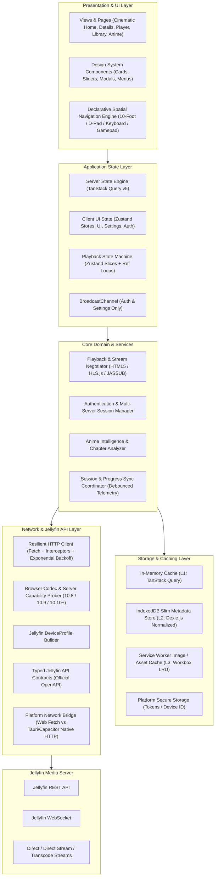

# CineTheme System Architecture Specification

## 1. Executive Summary & Architectural Vision

**CineTheme** is a high-performance, web-first, production-grade Jellyfin media client engineered to provide a cinematic, modern, and fluid streaming experience. While designed from the ground up to excel on desktop and mobile web (including Progressive Web App capabilities), the architecture is strictly modularized to cleanly support secondary platform shells (Windows via Tauri v2, Android and Android TV via optimized web-view wrappers/Capacitor).

The architectural design prioritizes:
1. **Uncompromised Web Experience:** The web client is the flagship product. No design compromises or performance trade-offs are made to satisfy secondary platforms.
2. **Native-Grade Media Playback:** Sophisticated format capability detection, direct stream negotiation, custom WebAssembly-powered subtitle rendering (ASS/SSA via JASSUB/libass), trickplay scrubbers, frame-accurate chapter/intro skipping, and per-session audio/subtitle synchronization controls.
3. **Decoupled Layering:** Strict boundary separation between Jellyfin API communication, domain models, caching engines, state management, and presentation UI.
4. **Resilience & Offline Preparedness:** Optimistic UI updates, robust multi-tier caching (Memory $\to$ IndexedDB $\to$ Service Worker), network failure isolation, clean session lifecycle, and transparent recovery.
5. **Anime as a First-Class Citizen:** Deep support for multi-audio tracks, signs & songs forced subtitle tracks, complex styled subtitle rendering (SSA/ASS) without server video transcoding, episode ordering types, and automated chapter-based intro/outro detection.

---

## 2. High-Level System Architecture

CineTheme is organized into distinct, unidirectional layers:



---

## 3. Core Architectural Principles

### 3.1 Unidirectional Data Flow
All state mutations flow strictly downwards from explicit user actions or server events through domain services into state stores, which trigger reactive UI renders. Direct mutations of state from UI components are forbidden.

### 3.2 Strict Separation of Concerns
1. **Zero Raw API Calls in UI:** Components must never invoke `fetch` or call Jellyfin endpoints directly. They consume typed hooks exposing queries, mutations, or domain controllers.
2. **Platform Abstraction Layer (PAL):** Platform-specific APIs (storage, window chrome, media session, power management, native HTTP bridges) are accessed through unified interfaces, guaranteeing that web, desktop, and mobile implementations can be swapped without modifying core business logic.
3. **Data Normalization & DTO Mapping:** Server-returned raw Jellyfin DTOs are mapped into strongly-typed CineTheme Domain Models at the API boundary to insulate the application from server schema variations across Jellyfin versions.

### 3.3 Zero-Cost Anime First-Class Citizenship
Anime media items are processed with enhanced metadata inspectors that detect:
- Dual/multi audio arrangements (e.g., Japanese audio paired with English Signs & Songs subtitles vs English Dub).
- ASS/SSA subtitles rendered via WebAssembly (JASSUB/libass) directly on an overlay canvas over standard HTML5 `<video>`, eliminating the need for Jellyfin CPU/GPU burning/transcoding.
- Embedded font attachments fetched on-demand (`/Videos/{itemId}/{mediaSourceId}/Attachments/{index}`) with universal bundled fallback fonts.
- Chapter markers matching anime themes (`OP`, `ED`, `Opening`, `Ending`, `Theme`) as the primary universal intro detection mechanism, with optional plugin fallback.

---

## 4. Module Decomposition & Boundaries

```
src/
├── app/                  # Application routing, layout shells, entry points
├── core/                 # Foundation utilities, configuration, constants
│   ├── config/           # App runtime configuration & feature flags
│   ├── platform/         # Platform Abstraction Layer (Web, Tauri, Capacitor)
│   └── errors/           # Unified error definitions and error boundaries
├── api/                  # Jellyfin API client and DTOs
│   ├── client/           # Custom typed fetch client with auth & retry interceptors
│   ├── endpoints/        # Pure API endpoint definitions (REST)
│   ├── profiles/         # Jellyfin DeviceProfile capability builders
│   └── websocket/        # WebSocket client for real-time server events
├── domain/               # Core business logic and domain entities
│   ├── auth/             # Multi-server session management & credentials
│   ├── media/            # Item models, library categorization, anime helpers
│   ├── player/           # Playback controller, stream negotiator, track selector, sync offsets
│   └── sync/             # Progress sync, debounced playback reporting, resume tracking
├── storage/              # Caching and persistence adapters
│   ├── db/               # Dexie.js IndexedDB schema (slim normalized projections)
│   └── secure/           # Secure token storage per platform
├── state/                # State management stores and hooks
│   ├── query/            # TanStack Query configurations, queries, mutations
│   ├── stores/           # Zustand client stores (UI, Settings, Auth, Active Player)
│   └── navigation/       # Declarative spatial navigation focus manager state
├── components/           # Reusable UI component system
│   ├── ui/               # Atomic design primitives (Button, Modal, Slider, etc.)
│   ├── media/            # Media cards, poster grids, backdrop banners, carousels
│   ├── player/           # Player controls, overlay HUD, scrubber, settings menu
│   └── navigation/       # Navbar, sidebar, search bar, focusable containers
└── views/                # Route view compositions
    ├── home/             # Featured hero banner, continue watching, next up
    ├── library/          # Filterable, sortable, virtualized media grids
    ├── details/          # Movie/Show/Anime details, seasons, cast, stream details
    ├── player/           # Immersive full-viewport playback view
    └── settings/         # Server management, playback preferences, theme config
```

---

## 5. Security & Network Model

### 5.1 Token Lifecycle & Security
- **Long-Lived Session Tokens:** Jellyfin `AccessToken` is treated as a persistent session identifier. There is no silent token refresh flow.
- **Explicit Invalidation on 401:** If the Jellyfin server returns HTTP 401 Unauthorized, the session has been revoked on the server or the user was deleted. CineTheme immediately clears the active session and routes the user to the Server Selection/Login screen.
- **Zero Plaintext Password Storage:** User passwords are transmitted once during authentication (`POST /Users/AuthenticateByName`) and immediately discarded from memory. Passwords are never persisted in `localStorage`, IndexedDB, or logs.
- **Single-Use QuickConnect:** QuickConnect secrets are consumed upon authentication and never stored or reused.

### 5.2 Mixed Content & Network Topologies
- **HTTPS Web Deployments:** When CineTheme Web/PWA is served over HTTPS (`https://cinetheme.app`), it can connect to HTTPS Jellyfin instances. Connection to unencrypted local HTTP servers (`http://192.168.x.x:8096`) is blocked by browser Mixed Content Security. Users are instructed to configure a TLS reverse proxy (Caddy, Nginx, Cloudflare Tunnel, or Tailscale HTTPS) or use local HTTP CineTheme instances.
- **Local HTTP Deployments:** When CineTheme is self-hosted locally over HTTP (`http://localhost:5173` or local Docker container), browser Mixed Content restrictions do not apply, allowing direct connection to local HTTP Jellyfin servers.
- **Desktop (Tauri) & Mobile (Android):** Secondary platform shells use native HTTP network bridges (and `android:usesCleartextTraffic="true"`) to connect seamlessly to both HTTP and HTTPS Jellyfin instances without browser Mixed Content or CORS restrictions.

---

## 6. Performance & Scalability Architecture

1. **Virtualized Rendering for Large Libraries:**
   - All library views, episode lists, and search results containing $>50$ items use virtualized grid rendering (`@tanstack/react-virtual`) to maintain a constant DOM node count and 60/120 FPS scrolling regardless of library size (10,000+ items).
2. **Slim Metadata Storage in IndexedDB:**
   - IndexedDB stores only lightweight, normalized projections (IDs, titles, years, image tags, watch status) to prevent storage quota exhaustion and Safari 7-day storage purges.
3. **Decoupled Playback Progress Telemetry:**
   - UI scrubber updates operate on local frame loops or isolated slice subscriptions.
   - Network progress reporting (`/Sessions/Playing/Progress`) uses a 500ms trailing debounce on seek events and a strict 10-second heartbeat during playback.
4. **Service Worker Image Caching:**
   - Immutable tagged artwork (`&tag={tag}`) is cached via Workbox with a conservative 150MB LRU quota to prevent mobile browser storage purges.
