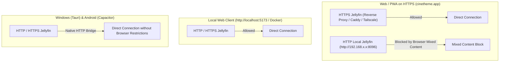

# CineTheme Definitive Architecture Baseline

**Document Status:** AUTHORITATIVE BASELINE  
**Product:** CineTheme  
**Primary Platform:** Web / PWA (Flagship)  
**Secondary Platforms:** Windows (Tauri v2), Android (Capacitor v6), Android TV (Capacitor TV Shell)

---

## 1. Product Vision & Platform Priorities

**CineTheme** is a production-grade, web-first Jellyfin client engineered to deliver a luxury cinematic streaming experience with native-grade performance and first-class anime support.

### 1.1 Core Platform Hierarchy
1. **Web (Flagship):** Desktop, tablet, and mobile browsers. No feature, design element, or performance attribute is ever compromised to satisfy secondary platforms.
2. **PWA (Progressive Web App):** Installable web application with standalone display mode, offline metadata browsing, and local image caching.
3. **Windows Desktop (Tauri v2):** Ultra-lightweight desktop package (<40MB RAM) using native WebView2, custom borderless window chrome, and OS media keys.
4. **Android & Android TV (Capacitor v6):** Shared web codebase wrapped in a native Android shell with hardware decoding, Leanback TV intents, and 10-foot spatial D-pad navigation.

---

## 2. Definitive Technology Stack

| Layer | Technology | Key Responsibility |
|---|---|---|
| **Core Framework** | **React 19 + TypeScript 5 (Strict Mode)** | Component lifecycle, hooks, and strict end-to-end type safety across Jellyfin DTOs and domain models. |
| **Bundler & Tooling** | **Vite 6** | Instant HMR, native WebAssembly bundling for JASSUB, and PWA plugin integration. |
| **Design System & CSS** | **Tailwind CSS v4 + Radix UI** | Zero-runtime CSS engine, dark cinematic design tokens, headless accessible UI primitives. |
| **Server State Engine** | **TanStack Query v5** | Asynchronous server caching, request deduplication, background revalidation, query key factories. |
| **Client State Stores** | **Zustand v5 + Immer** | Client UI state, session profiles, persisted settings, and fine-grained selector subscriptions. |
| **Persistent Metadata** | **Dexie.js (IndexedDB)** | High-speed indexed querying for 10,000+ items using **slim normalized projections** (max 25MB). |
| **Video Playback Engine** | **HTML5 `<video>` + Hls.js** | Native Direct Play for MP4/WebM; seamless Direct Stream remuxing and HLS transcoding fallback. |
| **Anime Subtitle Engine** | **JASSUB (libass WebAssembly)** | Pixel-perfect SSA/ASS styling, positioning, and karaoke rendered in a Web Worker via OffscreenCanvas. |
| **Spatial Navigation** | **Single Declarative Focus Engine** | 2D D-pad, keyboard, and remote navigation mapped directly to DOM focus and CSS `:focus-visible`. |
| **List Virtualization** | **`@tanstack/react-virtual`** | Headless virtualization maintaining 60/120 FPS scrolling across large library catalogs. |
| **Desktop Shell** | **Tauri v2 (Rust + WebView2)** | Native Windows packaging, OS media hotkeys, system tray, and secure credential storage. |
| **Mobile & TV Shell** | **Capacitor v6** | Native Android container with cleartext traffic allowances and Android TV Leanback launcher support. |
| **Quality Assurance** | **Vitest + RTL + MSW + Playwright** | Unit testing, authentic Jellyfin REST OpenAPI mocks, and automated multi-browser E2E testing. |

---

## 3. Application Architecture & Module Boundaries

CineTheme enforces strict unidirectional data flow and complete boundary separation:

```
src/
├── app/                  # Application routing, layout shells, entry points
├── core/                 # Foundation utilities, runtime config, Platform Abstraction Layer (PAL)
├── api/                  # Typed Jellyfin REST client, DeviceProfile builder, DTO schemas
├── domain/               # Core business logic (auth, media models, stream negotiator, chapter parser)
├── storage/              # Dexie.js IndexedDB schema (slim projections) & secure storage
├── state/                # TanStack Query keys/hooks, Zustand stores (auth, player, UI, settings)
├── components/           # UI design system primitives, media cards, focus traps, player HUD
├── views/                # Route views (Home, Library, Details, Player, Settings)
└── utils/                # Ticks/seconds math, image URL builders with DPR scaling
```

---

## 4. Jellyfin API & Authentication Model

### 4.1 Authentication & Token Lifecycle
- **Official Endpoints:** `POST /Users/AuthenticateByName` and `POST /Users/AuthenticateWithQuickConnect`.
- **Session Token Model:** Jellyfin `AccessToken` is treated strictly as a long-lived session token.
- **Zero Plaintext Password Storage:** User passwords are transmitted once for authentication and immediately wiped from memory. Passwords are never written to disk or logs.
- **Explicit 401 Revocation:** On HTTP 401 Unauthorized, CineTheme immediately invalidates the active session and routes the user to the Login screen. Silent token refresh is strictly prohibited.
- **Single-Use QuickConnect:** QuickConnect secrets are consumed upon authentication and discarded.

### 4.2 Authorization Headers
Every authenticated request includes the official MediaBrowser header:
```http
X-Emby-Authorization: MediaBrowser Client="CineTheme", Device="Web", DeviceId="{uniqueDeviceId}", Version="1.0.0", Token="{token}"
```
*(Query parameter authentication `?api_key={token}` is used for static media streams and image tags).*

---

## 5. Network Topologies & Security Model



### 5.1 Rules by Platform:
1. **Hosted HTTPS Web:** Requires Jellyfin to be accessible over HTTPS with a valid TLS certificate (via reverse proxy like Caddy/Nginx or Tailscale HTTPS).
2. **Local HTTP Web:** Connects directly to local `http://` Jellyfin servers without Mixed Content restrictions.
3. **Tauri & Capacitor Shells:** Use native HTTP networking and cleartext traffic configurations to connect freely to both HTTP and HTTPS servers.

---

## 6. Video Player Architecture & Transcode Negotiation

### 6.1 Playback Decision Matrix
CineTheme dynamically probes the host browser at runtime and negotiates stream delivery via `POST /Items/{itemId}/PlaybackInfo`:

| Playback Method | Criteria & Conditions | Server Action |
|---|---|---|
| **Direct Play (`static=true`)** | Native container (**MP4**, **WebM**) AND native codecs (**H.264**, **AV1**, **VP9** + **AAC**, **Opus**, **FLAC**). | Zero server processing. Static byte stream. |
| **Direct Stream (HLS Remux)** | Video codec is supported, but container is **MKV** OR audio codec is unsupported (**DTS**, **TrueHD**, **AC-3**). | Video track is copied directly (0% CPU); container or audio is remuxed into HLS segments. |
| **Transcoding (HLS)** | Video codec is unsupported by browser hardware OR user constrained streaming bitrate. | Server transcodes video and audio into H.264/AAC HLS stream. |

---

## 7. Subtitle Engine & Anime Features

### 7.1 JASSUB WebAssembly Engine
- Compiles `libass` to WebAssembly, executing in a dedicated Web Worker via `OffscreenCanvas`.
- Renders pixel-perfect ASS/SSA typography, positioning, vector drawings, and karaoke effects directly on a canvas overlay over `<video>`.

### 7.2 Font Attachment & Fallback Architecture
- **Zero Startup Delay:** Player begins video playback immediately using bundled universal fallback fonts (Arial, Open Sans, Gandhi Sans, Noto Sans).
- **Lazy Font Attachments:** Embedded fonts are fetched asynchronously from `/Videos/{itemId}/{mediaSourceId}/Attachments/{index}` in the background and dynamically registered into the running JASSUB instance.

### 7.3 Audio & Subtitle Synchronization Controls
- **Audio Delay:** $-5000\text{ms}$ to $+5000\text{ms}$ in $50\text{ms}$ increments.
- **Subtitle Delay:** $-5000\text{ms}$ to $+5000\text{ms}$ in $50\text{ms}$ increments.
- Maintained per playback session in volatile player state (reset per media item).

### 7.4 Anime Intro & Outro Detection
- **Primary Universal Detector:** Regex matching against native Jellyfin chapter markers (`item.Chapters`).
- **Optional Enhancement:** Probes IntroSkipper plugin timestamps conditionally. If absent or 404, it is ignored cleanly without errors.

---

## 8. Debounced Telemetry & Session Reporting

To protect Jellyfin servers from request flooding during rapid scrubbing:
1. **Seek Telemetry:** 500ms trailing debounce on `Seek` progress reports (`POST /Sessions/Playing/Progress`).
2. **Playback Heartbeat:** Strict 10-second periodic interval during active playback.
3. **Synchronous Flush:** Immediate progress flush on pause, seek completion, and player exit.

---

## 9. State Management & Multi-Tier Caching

### 9.1 State Hierarchy
- **Server State (TanStack Query v5):** All asynchronous Jellyfin media queries, cached in volatile memory with TTL garbage collection.
- **Client State (Zustand v5):** UI state, session profiles, player HUD, and user preferences.
- **Cross-Tab Synchronization (BroadcastChannel):** Strictly limited to `AUTH_LOGOUT` and `SETTINGS_CHANGED`. Active playback timestamps are excluded.

### 9.2 Caching Tiers
1. **L1 (In-Memory Heap):** TanStack Query cache for active page items and detailed DTOs.
2. **L2 (IndexedDB via Dexie.js):** **Slim normalized projections** (ID, title, sortName, year, imageTag, type, resumeTicks, watched status). Max 25MB.
3. **L3 (Service Worker CacheStorage):** Immutable tagged artwork (`&tag={tag}`) with 150MB LRU eviction limit.
4. **L4 (Browser HTTP Disk Cache):** ETag and Cache-Control governed HTTP responses.

---

## 10. Multi-Platform & 10-Foot Spatial Navigation

- **Single Declarative Focus Engine:** Direct mapping to HTML DOM focus and CSS `:focus-visible` glow/scale states.
- **Focus Traps:** Strict modal and player HUD focus containment.
- **Platform Shells:**
  - **Windows:** Tauri v2 with custom borderless window titlebar and media hotkeys.
  - **Android & Android TV:** Capacitor v6 with Android TV Leanback launcher intents and hardware back-button routing.

---

## 11. Testing & Quality Assurance Strategy

In accordance with `AGENTS.md`, every milestone must pass the verification gate with zero errors and zero warnings:

```bash
npm run verify # Executes: tsc --noEmit && eslint . && vitest run && vite build
```

- **Unit Testing (Vitest):** Time math (ticks $\leftrightarrow$ seconds), chapter parsers, sprite coordinate math, DeviceProfile generator.
- **API Integration (MSW):** Official Jellyfin OpenAPI mocks (auth, playbackInfo, attachments, session telemetry).
- **Component Testing (RTL):** Design system components, focus management, player HUD controls.
- **E2E Automation (Playwright):** Full user flows (login, library browse, video playback, settings persistence).

---

## 12. Development Order & Milestones

1. **Milestone 1: Project Foundation & Design System Core** (Vite 6, React 19, TypeScript strict, Tailwind v4, Vitest, MSW, UI primitives).
2. **Milestone 2: Jellyfin API Client & Authentication Layer** (Typed client, MediaBrowser headers, multi-server manager, session lifecycle, clean 401 handling).
3. **Milestone 3: Home Hub, Virtualized Media Grids & Search** (User libraries, shelves, `@tanstack/react-virtual` grid, debounced search).
4. **Milestone 4: Media Details View & Anime Intelligence** (Cinematic details view, season/episode browsers, specials/OVA handling, chapter OP/ED detection).
5. **Milestone 5: Cinematic Video Player & Subtitle Engine** (DeviceProfile capability probing, Direct Stream HLS fallback, JASSUB Wasm ASS subtitles, lazy font attachments, debounced telemetry, sync delay controls).
6. **Milestone 6: Multi-Tier Caching, PWA & Offline Readiness** (Dexie.js slim IndexedDB schema, Workbox Service Worker image caching, offline action queue, PWA manifest).
7. **Milestone 7: Secondary Platforms & 10-Foot Spatial Navigation** (Unified spatial focus engine, Tauri v2 Windows shell, Capacitor Android / Android TV shell, Playwright E2E suite).

---

## 13. Features Explicitly Out of Scope (What NOT to Build Yet)

- Server administration and hardware transcoder dashboard settings.
- Metadata editing and NFO scraper configuration.
- Live TV / DVR scheduling and recording pipelines.
- User account creation, deletion, or permission management.
- Arbitrary custom CSS / JS injection.
- In-app torrenting or P2P downloading.
- In-app offline video file downloads (OPFS).
- SyncPlay multi-user synchronization.

---

## 14. Ready for Implementation Checklist

- [x] All 9 architectural specifications created and updated with zero cross-document contradictions.
- [x] "Silent token refresh" assumption removed; long-lived session token model and clean 401 logout established.
- [x] Web vs Desktop vs Android networking and Mixed Content security models fully specified.
- [x] Browser playback capability matrix redesigned (Direct Play for MP4/WebM, Direct Stream HLS for MKV/DTS).
- [x] Subtitle font attachment endpoint corrected (`/Attachments/{index}`) with universal bundled fallbacks and lazy background loading.
- [x] Playback telemetry redesigned with 500ms trailing seek debounce and 10s heartbeat.
- [x] Jellyfin version gating and feature probing established (10.8 vs 10.9 vs 10.10+).
- [x] IntroSkipper plugin made completely optional; native Jellyfin chapters established as primary.
- [x] Spatial navigation unified into a single declarative DOM-focused engine.
- [x] IndexedDB schema slimmed to lightweight normalized projections (max 25MB).
- [x] Audio and Subtitle Delay synchronization controls added to player specifications.
- [x] BroadcastChannel restricted strictly to Auth and Settings synchronization.
- [x] Architecture review and resolution report finalized in `ARCHITECTURE_REVIEW.md`.
- [x] Authoritative architecture baseline established in `ARCHITECTURE_BASELINE.md`.
- [x] Quality gates and verification scripts defined (`npm run verify`).
