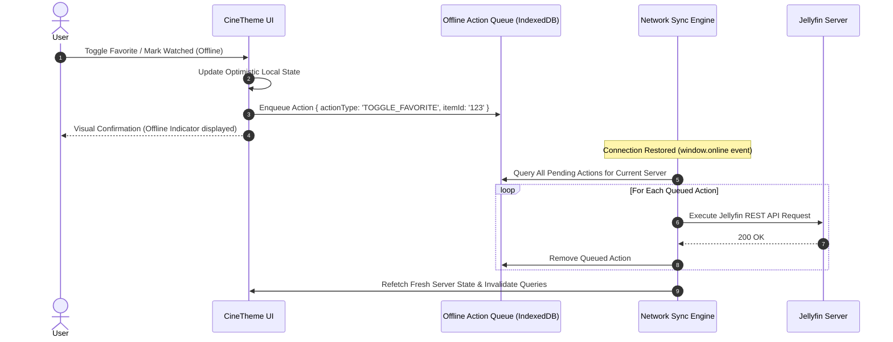

# CineTheme Caching & Storage Architecture Specification

## 1. Multi-Tier Caching Architecture

To achieve instant screen transitions, zero network duplication, and offline browsing capability, CineTheme deploys a calibrated 4-tier caching architecture:

```mermaid
graph TD
    Request[Data / Media / Image Request] --> L1{L1: In-Memory Cache<br/>TanStack Query / Zustand}
    L1 -->|Hit (< 1ms)| ReturnL1[Return Memory Object]
    L1 -->|Miss| L2{L2: Persistent Store<br/>Dexie.js Slim Projections}
    
    L2 -->|Hit (< 10ms)| HydrateL1[Hydrate L1 & Return Data]
    L2 -->|Miss| L3{L3: Service Worker<br/>CacheStorage API}
    
    L3 -->|Hit (< 20ms)| ReturnL3[Return Cached Asset / Image]
    L3 -->|Miss| L4{L4: HTTP Network & Server<br/>Jellyfin API}
    
    L4 -->|HTTP 200 / 304| SaveCaches[Populate L1, L2, L3]
    SaveCaches --> ReturnFinal[Deliver to UI]
```

---

## 2. Tier Breakdown & Responsibilities

| Cache Tier | Storage Technology | Target Contents | Lifetime / Invalidation | Eviction Policy & Limits |
|---|---|---|---|---|
| **Tier 1: In-Memory (L1)** | JavaScript Heap (QueryCache) | Detailed item metadata, cast, stream configurations, active playback state. | Component unmount / TTL (5-10 min) | Garbage collected when unused |
| **Tier 2: Metadata DB (L2)**| IndexedDB via Dexie.js | **Lightweight Normalized Projections** for library catalogs, search indexes, offline action queue. | Persistent across sessions; updated on server sync. | Max 25MB metadata storage |
| **Tier 3: Asset & Image (L3)**| Service Worker `CacheStorage` | Web App Shell, UI fonts, WASM binaries (JASSUB), tagged media posters and backdrops. | Tag-based immutable caching; 30 days for tagged media art. | LRU eviction; max 150MB quota for images |
| **Tier 4: Network Cache (L4)**| Browser HTTP Cache | REST API responses with HTTP `ETag` and `Cache-Control`. | Governed by Jellyfin HTTP headers. | Native browser disk cache eviction |

---

## 3. Slim Persistent Metadata Layer: Dexie.js Schema

CineTheme stores **strictly lightweight normalized projections** in IndexedDB rather than deep nested Jellyfin DTOs:

```typescript
import Dexie, { Table } from 'dexie';

export interface SlimLibraryItemProjection {
  id: string;
  serverId: string;
  userId: string;
  parentId: string;
  type: 'Movie' | 'Series' | 'Season' | 'Episode' | 'BoxSet';
  name: string;
  sortName: string;
  productionYear?: number;
  communityRating?: number;
  isPlayed: boolean;
  isFavorite: boolean;
  playbackPositionTicks?: number;
  primaryImageTag?: string;
  backdropImageTag?: string;
  genres: string[];
  lastSyncedAt: number;
}

export interface OfflineActionQueueItem {
  id?: number;
  serverId: string;
  userId: string;
  actionType: 'MARK_PLAYED' | 'MARK_UNPLAYED' | 'TOGGLE_FAVORITE' | 'PROGRESS_UPDATE';
  itemId: string;
  payload: Record<string, unknown>;
  createdAt: number;
}

export class CineThemeDatabase extends Dexie {
  items!: Table<SlimLibraryItemProjection, string>;
  offlineQueue!: Table<OfflineActionQueueItem, number>;

  constructor() {
    super('CineTheme_DB');
    this.version(1).stores({
      items: 'id, [serverId+userId], parentId, type, sortName, isPlayed, isFavorite, lastSyncedAt',
      offlineQueue: '++id, [serverId+userId], actionType, createdAt',
    });
  }
}

export const db = new CineThemeDatabase();
```

---

## 4. Browser Storage Limitations & Mitigation Strategy

### 4.1 Mobile Safari 7-Day Storage Eviction
- **The Browser Rule:** WebKit (iOS Safari) enforces a policy where IndexedDB and CacheStorage can be wiped after 7 days if the site is not visited or not added to the home screen as a standalone PWA.
- **CineTheme Mitigation:**
  - Slim metadata footprint ensures that even if IndexedDB is evicted, cold synchronization of 5,000 items takes $< 500\text{ms}$.
  - Prompt users on mobile Safari to install CineTheme to the Home Screen (`standalone` mode), which grants persistent storage exemption.

### 4.2 Storage Quota Management
- Workbox CacheStorage limit for images is capped at **150MB** with LRU eviction.
- Large video caching is explicitly deferred, avoiding storage pressure warnings on mobile devices.

---

## 5. Offline Resiliency & Action Synchronization Queue


