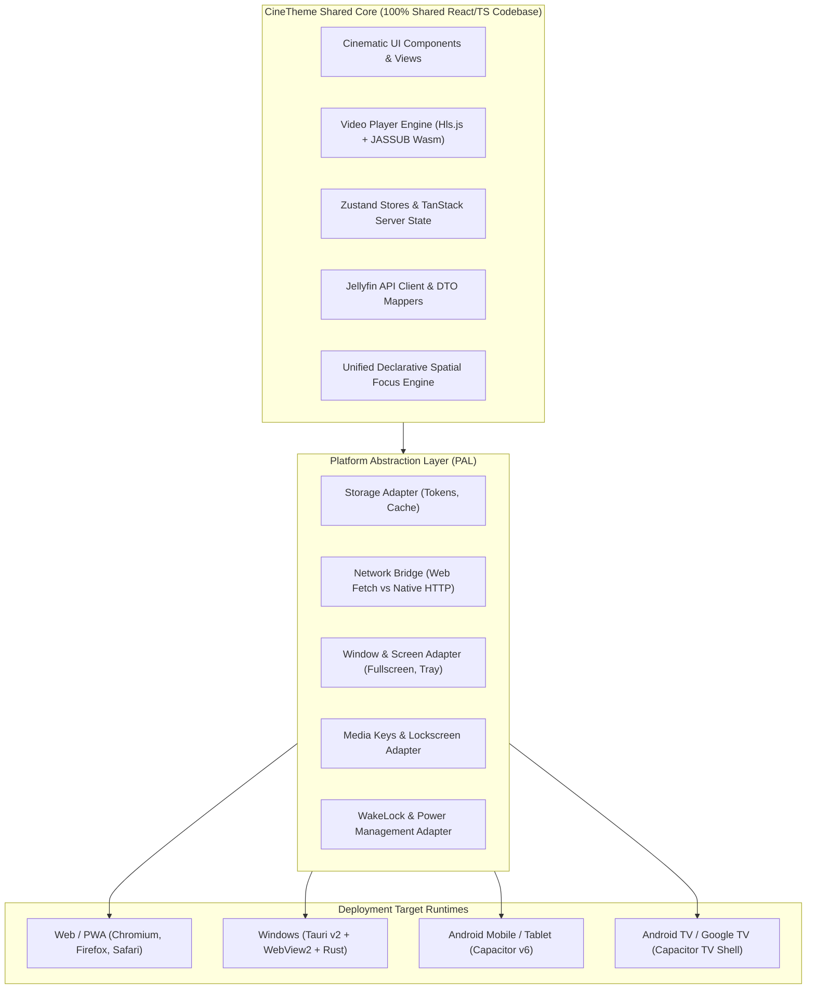
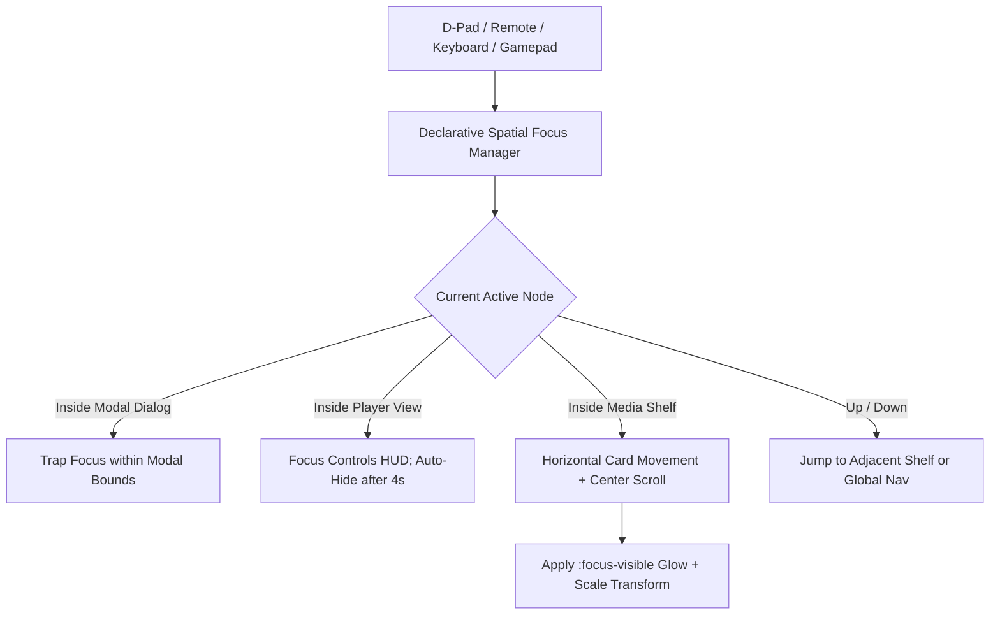

# CineTheme Multi-Platform Architecture Specification

## 1. Platform Hierarchy & Philosophy

As mandated by `AGENTS.md`:
- **Primary Flagship Platform:** **Web & PWA** (Desktop, Tablet, Mobile). The web client is the flagship product; its performance, cinematic aesthetic, and ergonomics will never be compromised for secondary platforms.
- **Secondary Platforms:** **Windows** (Tauri v2), **Android** (Capacitor v6), and **Android TV** (Capacitor TV Shell + Declarative Spatial Navigation).



---

## 2. Platform Networking & Security Matrix

| Platform Target | Runtime Environment | Connection to HTTPS Jellyfin | Connection to HTTP Jellyfin | Network Security Notes |
|---|---|---|---|---|
| **Web / PWA (Hosted HTTPS)** | Modern Browsers | Supported | **Blocked by Browser Mixed Content** | Users must expose Jellyfin over HTTPS (Caddy/Nginx reverse proxy, Tailscale HTTPS, or Cloudflare Tunnel). |
| **Web (Local HTTP)** | `http://localhost:5173` / Docker | Supported | Supported | Permitted because origin is unencrypted HTTP or localhost. |
| **Windows Desktop (Tauri v2)** | Tauri Rust + WebView2 | Supported | Supported | Native Rust HTTP bridge bypasses browser Mixed Content restrictions without security degradation. |
| **Android Phone / Tablet** | Capacitor v6 | Supported | Supported | Enabled via `android:usesCleartextTraffic="true"` and Capacitor Native HTTP. |
| **Android TV / Google TV** | Capacitor TV Shell | Supported | Supported | Same native bridge; connects freely to local `http://192.168.x.x:8096`. |

---

## 3. Platform Abstraction Layer (PAL) Interface Contracts

```typescript
export interface IPlatformAdapters {
  storage: IStorageAdapter;
  network: INetworkAdapter;
  window: IWindowAdapter;
  mediaSession: IMediaSessionAdapter;
  wakeLock: IWakeLockAdapter;
  device: IDeviceAdapter;
}

export interface IStorageAdapter {
  getItem: (key: string) => Promise<string | null>;
  setItem: (key: string, value: string) => Promise<void>;
  removeItem: (key: string) => Promise<void>;
  getSecureToken: (key: string) => Promise<string | null>;
  setSecureToken: (key: string, token: string) => Promise<void>;
}

export interface INetworkAdapter {
  fetch: (url: string, init?: RequestInit) => Promise<Response>;
}

export interface IWindowAdapter {
  isFullscreen: () => boolean;
  requestFullscreen: () => Promise<void>;
  exitFullscreen: () => Promise<void>;
  setPictureInPicture: (active: boolean) => Promise<void>;
  setAppTitle: (title: string) => void;
}

export interface IMediaSessionAdapter {
  updateMetadata: (meta: MediaMetadataInit) => void;
  setActionHandlers: (handlers: MediaSessionHandlers) => void;
  clear: () => void;
}

export interface IWakeLockAdapter {
  requestLock: () => Promise<void>;
  releaseLock: () => Promise<void>;
}

export interface IDeviceAdapter {
  getDeviceId: () => Promise<string>;
  getDeviceName: () => string;
  getPlatformType: () => 'web' | 'pwa' | 'windows' | 'android' | 'android-tv';
}
```

---

## 4. Single Unified Spatial Navigation Architecture

CineTheme deploys a single declarative spatial navigation system mapping directional inputs directly to standard DOM focus:



### 4.1 Key Focus Principles:
1. **Single Source of Truth:** Focus is tracked via standard HTML DOM focus (`document.activeElement`) and CSS `:focus-visible`. No competing secondary focus state trees.
2. **Predictable Modal & Player Focus Traps:** When a dialog, search overlay, or player settings menu opens, focus is strictly trapped within the active container, preventing background focus leaks.
3. **Hardware Back-Button Integration:** On Android and Android TV remotes, `Back` closes the topmost modal/menu first; if no modals are open, it navigates back in application history.
