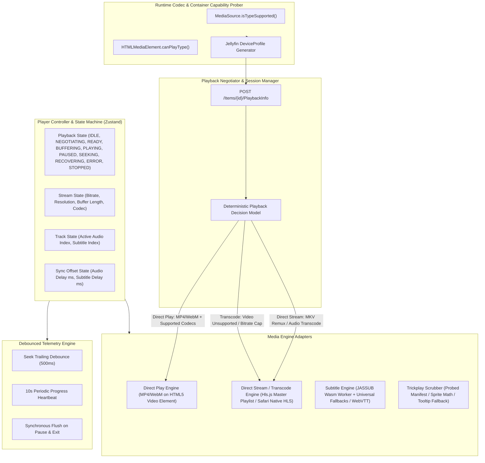
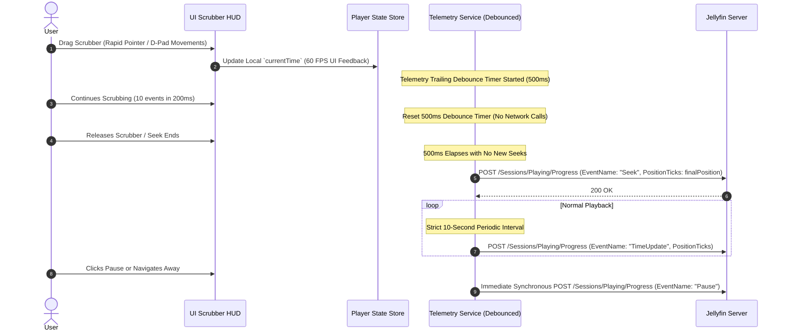
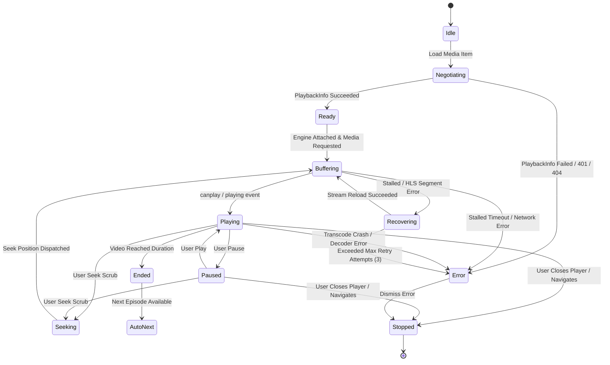

# CineTheme Video Player Architecture Specification

## 1. Playback Architecture Overview

The video player is the core experiential pillar of CineTheme. It delivers fluid, broadcast-quality streaming with instantaneous seeking, zero-delay resume, pixel-perfect anime subtitle typography, per-session audio/subtitle synchronization, and responsive controls across mouse, touch, keyboard, and TV remotes.



---

## 2. Playback Decision Matrix & Transcode Negotiation

CineTheme never assumes universal codec or container support. It probes the host browser at runtime and negotiates stream delivery with Jellyfin:

### 2.1 Playback Method Definitions
1. **Direct Play (`static=true`):** Used **ONLY** when both the container (MP4, WebM) and the codecs (H.264/AV1/VP9 + AAC/Opus/FLAC) are natively playable by the host browser's `<video>` element.
2. **Direct Stream (Remuxing via HLS):** Used when the video codec is natively supported (e.g. H.264, HEVC on supported hardware), but:
   - The container is MKV (unsupported by standard `<video>` in Firefox/Safari/Chromium), OR
   - The audio codec is unsupported (e.g. DTS, TrueHD, AC-3).
   Jellyfin remuxes the video stream with zero CPU transcode overhead and converts only the container or audio track into HLS segments.
3. **Transcode:** Used strictly when the video codec is unsupported by browser hardware or when the user manually restricts the bitrate.

### 2.2 Dynamic DeviceProfile Builder

```typescript
export function buildDeviceProfile(): JellyfinDeviceProfile {
  const isMp4Supported = document.createElement('video').canPlayType('video/mp4') !== '';
  const isWebmSupported = document.createElement('video').canPlayType('video/webm') !== '';
  const isMkvSupported = document.createElement('video').canPlayType('video/x-matroska') !== '';

  const isHevcSupported =
    window.MediaSource?.isTypeSupported('video/mp4; codecs="hvc1.1.6.L153.B0"') ||
    window.MediaSource?.isTypeSupported('video/mp4; codecs="hev1.1.6.L153.B0"') ||
    false;

  const isAv1Supported = window.MediaSource?.isTypeSupported('video/mp4; codecs="av01.0.08M.08"') || false;
  const isVp9Supported = window.MediaSource?.isTypeSupported('video/webm; codecs="vp9"') || false;

  // Audio probing (Browsers natively support AAC, Opus, MP3, FLAC)
  const directAudioCodecs = ['aac', 'mp3', 'opus', 'flac', 'vorbis', 'wav'];

  const directPlayContainers: string[] = [];
  if (isMp4Supported) directPlayContainers.push('mp4', 'm4v');
  if (isWebmSupported) directPlayContainers.push('webm');
  if (isMkvSupported) directPlayContainers.push('mkv'); // Only if browser explicitly supports MKV

  return {
    Name: 'CineTheme Web Player',
    Id: 'cinetheme-web-v1',
    MaxStreamingBitrate: 120_000_000,
    MaxStaticBitrate: 120_000_000,
    DirectPlayProfiles: [
      {
        Container: directPlayContainers.join(','),
        Type: 'Video',
        VideoCodec: [
          'h264',
          ...(isHevcSupported ? ['hevc', 'h265'] : []),
          ...(isAv1Supported ? ['av1'] : []),
          ...(isVp9Supported ? ['vp9'] : []),
        ].join(','),
        AudioCodec: directAudioCodecs.join(','),
      },
      {
        Container: 'mp3,aac,flac,opus,wav,ogg',
        Type: 'Audio',
        AudioCodec: directAudioCodecs.join(','),
      },
    ],
    TranscodingProfiles: [
      {
        Container: 'ts',
        Type: 'Video',
        VideoCodec: 'h264',
        AudioCodec: 'aac,mp3,opus',
        Protocol: 'hls',
        Context: 'Streaming',
        BreakOnNonKeyFrames: true,
      },
    ],
    ContainerProfiles: [],
    CodecProfiles: [],
    SubtitleProfiles: [
      { Format: 'vtt', Method: 'External' },
      { Format: 'srt', Method: 'External' },
      { Format: 'ass', Method: 'External' },
      { Format: 'ssa', Method: 'External' },
    ],
    ResponseProfiles: [],
  };
}
```

---

## 3. Subtitle Engine & Lazy Font Attachment Architecture

```mermaid
graph TD
    SubTrack[Selected Subtitle Track] --> FormatCheck{Subtitle Format}

    FormatCheck -->|VTT / SRT| NativeTrack[HTML5 TextTrack / Custom WebVTT Renderer]
    FormatCheck -->|ASS / SSA| JASSUB_Engine[JASSUB WebAssembly libass Worker]
    FormatCheck -->|PGS / VOBSUB| BurnIn[Request Server Burn-In Transcode]

    JASSUB_Engine --> LoadFallbacks[Load Bundled Fallback Fonts: Arial, Open Sans, Gandhi Sans]
    LoadFallbacks --> StartVideo[Start Video Immediately without Delay]
    StartVideo --> LazyFontCheck{Has Embedded Font Attachments?}
    
    LazyFontCheck -->|Yes| AsyncFetch[Fetch /Attachments/{idx} in Background]
    AsyncFetch --> InjectFont[Inject New Font into JASSUB Worker at Runtime]
    LazyFontCheck -->|No / Failed 404| KeepFallbacks[Continue Smooth Playback with Fallback Fonts]
```

### 3.1 Lazy Font Attachment Strategy
- **No Playback Startup Blocking:** The player starts video playback immediately with bundled universal fonts.
- **Attachment Endpoint:** Font attachments embedded in the media are fetched via `/Videos/{itemId}/{mediaSourceId}/Attachments/{attachmentIndex}`.
- **Background Ingestion:** As font attachments download in the background, they are dynamically registered in the active `JASSUB` instance without interrupting video frames.
- **Resilience:** If an attachment returns 404 or fails, JASSUB automatically maps to the bundled fallback fonts without throwing errors.

---

## 4. Debounced Playback Telemetry Architecture

To prevent server flooding and database locking during timeline scrubbing:



---

## 5. Playback Finite State Machine & Error Recovery



### 5.1 Recovery Guarantees
1. **Exponential Backoff:** Up to 3 automatic recovery attempts (500ms, 1500ms, 3000ms) on transient network or buffer errors.
2. **Position Retention:** Recovery maintains current `PlaybackPositionTicks` without resetting to 00:00.
3. **Actionable UI:** Fatal errors present clear explanations and a **Retry Playback** button.

---

## 6. Audio & Subtitle Synchronization Controls

Anime releases and external subtitles frequently exhibit minor time offsets. CineTheme incorporates per-session synchronization adjustments:

### 6.1 Controls Specification
- **Audio Delay:** Range $-5000\text{ms}$ to $+5000\text{ms}$ in $50\text{ms}$ increments.
  - Controlled via `controller.setAudioDelay(ms)` updating `usePlayerStore.audioDelayMs`.
- **Subtitle Delay:** Range $-5000\text{ms}$ to $+5000\text{ms}$ in $50\text{ms}$ increments.
  - Implemented directly in JASSUB (`jassubInstance.timeOffset = offsetInSeconds`) and WebVTT cue time adjustments.
- **Per-Session Scope:** Sync offsets are maintained in transient player state and reset when a new media item loads (preventing persistent global calibration errors).

---

## 7. Anime Intelligence & Chapter Detection

### 7.1 Priority Detection Hierarchy
1. **Primary Mechanism: Jellyfin Native Chapter Markers (`item.chapters`):**
   - Universal across all Jellyfin server versions (10.8, 10.9, 10.10+).
   - Regex matching on chapter names:
     - Intro: `/intro|opening|op\b|theme|prologue/i`
     - Outro: `/outro|ending|ed\b|credits|preview/i`
2. **Secondary Progressive Enhancement: IntroSkipper Plugin:**
   - Conditionally probed via `GET /Episode/{episodeId}/IntroTimestamps` or `GET /Plugin/IntroSkipper/Timestamps/{itemId}`.
   - If the endpoint returns 404, 500, or network error, CineTheme treats the plugin as absent and relies exclusively on chapter markers with zero user-visible error logs.

---

## 8. Trickplay Manifest & Scrubber Preview

### 8.1 Jellyfin Version & Feature Handling
- **Probe Item Metadata:** Inspect `item.Trickplay` manifest availability.
- **Jellyfin 10.9+ Servers:** Request `GET /Items/{itemId}/Trickplay/{width}/GetManifest`. Parse sprite sheet rows/cols, frame intervals, and calculate CSS background offsets.
- **Jellyfin 10.8 or Missing Trickplay:** If the manifest returns 404 or the server lacks Trickplay data, the scrubber HUD seamlessly falls back to a high-contrast timecode tooltip without thumbnail preview.

---

## 9. Cinematic Player UI Architecture & Interaction

### 9.1 Controller / UI Separation
The UI layer (`PlayerView`, `PlayerHUD`, `PlayerTimeline`) never directly interfaces with raw HTMLMediaElement APIs or Jellyfin networking. All interactions route through `PlayerController`, which coordinates `VideoEngine`, `HlsEngine`, `SubtitleEngine`, `PlaybackTelemetry`, and `usePlayerStore`.

### 9.2 Keyboard Navigation & Shortcuts
| Shortcut | Action | Scope / Notes |
|---|---|---|
| **Space** / **K** | Toggle Play / Pause | Evasion when typing in inputs/textareas |
| **Arrow Left** / **J** | Seek backward 10 seconds | Shift modifier extends seek to 30 seconds |
| **Arrow Right** / **L** | Seek forward 10 seconds | Shift modifier extends seek to 30 seconds |
| **Arrow Up** | Increase Volume by 5% | Clamped to 100% |
| **Arrow Down** | Decrease Volume by 5% | Clamped to 0% |
| **M** | Toggle Mute | Restores previous volume on unmute |
| **F** | Toggle Fullscreen | Uses standard cross-browser Fullscreen API |
| **Escape** | Close active menus / Exit Fullscreen | Unfocuses active overlays |

### 9.3 Mobile Gestures & Touch Support
- **Single Tap:** Toggles visibility of top/bottom HUD overlay.
- **Double Tap Left Third (<35% width):** Seeks backward 10 seconds.
- **Double Tap Right Third (>65% width):** Seeks forward 10 seconds.
- **Intelligent Auto-Hide:** HUD automatically hides after 3.5 seconds of pointer inactivity while playing, remaining persistently visible while paused, buffering, recovering, or when settings menus are active.

### 9.4 Browser APIs & Graceful Feature Detection
- **Fullscreen API:** Feature-detected across standard, webkit, and moz prefixes; handles user gesture rejections cleanly.
- **Picture-in-Picture API:** Feature-detected via `'pictureInPictureEnabled' in document`; control button automatically hidden on unsupported browsers.
- **Media Session API:** Feature-detected via `'mediaSession' in navigator`; synchronizes media title, episode subtitle, and backdrop artwork with OS lock screen controls and hardware media buttons.

### 9.5 Security & Token Redaction
All playback diagnostics, nerd stats modals, error boundaries, and console messages redact `api_key`, `Token`, and `password` parameters via `redactMediaUrl`, guaranteeing zero credential leakage in production.
