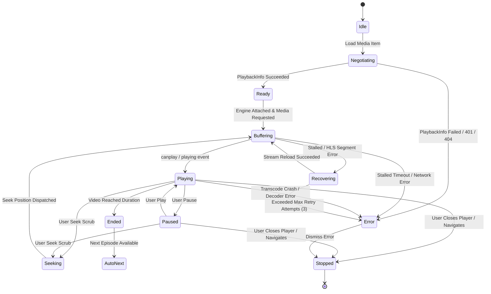
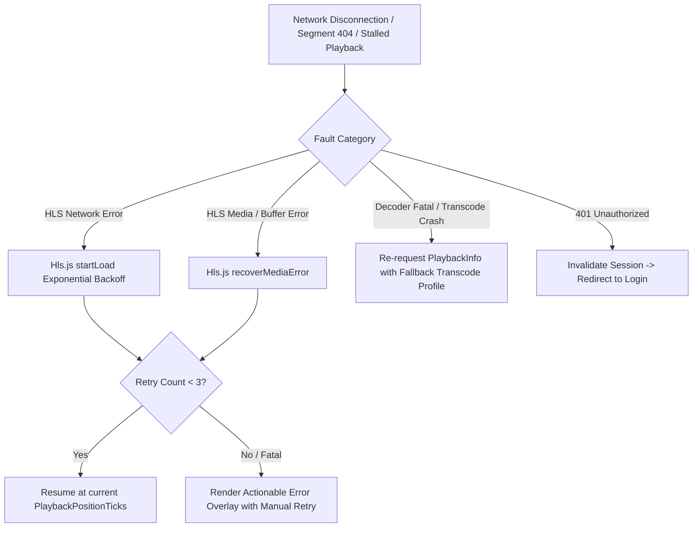

# CineTheme Player Architecture Review & Technical Evaluation

This document provides a deep architectural review of CineTheme's media playback subsystem, evaluating streaming engines, subtitle pipelines, device profile generation, telemetry synchronization, error recovery state machines, and platform implications.

---

## 1. Executive Summary & Engine Selection

### 1.1 Evaluated Media Engines
We evaluated three primary playback engine strategies for web media playback:
1. **Plain HTML5 `<video src="...">`:**
   - *Pros:* Zero bundle overhead, native hardware decoder pipeline, native battery efficiency, simple API.
   - *Cons:* Strictly limited to native MP4/WebM containers; cannot play MKV containers; cannot parse HLS master playlists on non-Apple browsers (Chrome, Firefox, Edge, Windows, Linux).
2. **MediaSource Extensions (MSE) with `Hls.js`:**
   - *Pros:* Industrial standard for HLS streaming across Chromium and Gecko engines; software/Wasm demuxing into MP4 fragments fed into native browser decoders; robust buffer management, multi-audio switching, adaptive bitrate (ABR), and granular recovery hooks.
   - *Cons:* $\approx 70\text{ kB}$ gzipped bundle size; requires Safari fallback to native HLS.
3. **Safari Native HLS (`video.src = "...m3u8"`):**
   - *Pros:* Native hardware acceleration on macOS/iOS, AirPlay integration, lower power consumption.
   - *Cons:* Black-box buffer controls, divergent event models compared to MSE.

### 1.2 Architectural Decision: Hybrid Dual-Engine Strategy
CineTheme adopts a **Hybrid Dual-Engine Architecture**:
- **Direct Play Mode:** Pure HTML5 `<video src="...">` for direct MP4 and WebM streams.
- **HLS Direct Stream & Transcode Mode:**
  - On Safari (macOS / iOS) where MSE HLS is disabled or native HLS is preferred: Native Apple HLS via `<video src="master.m3u8">`.
  - On Chrome, Edge, Firefox, Android, and TV WebViews: `Hls.js` utilizing MediaSource Extensions (`MSE`).

---

## 2. Playback State Machine Architecture

The playback subsystem is governed by a deterministic, strictly-typed finite state machine implemented in Zustand:

### 2.1 State Definitions
- **`IDLE`:** No media loaded; player DOM unmounted or hidden.
- **`NEGOTIATING`:** Probing `DeviceProfile` and awaiting `POST /Items/{itemId}/PlaybackInfo`.
- **`READY`:** Stream URL, active audio index, and subtitle streams resolved.
- **`BUFFERING`:** Network downloading initial segments / decoding keyframes.
- **`PLAYING`:** Clock advancing, 60fps presentation, 10s telemetry heartbeat active.
- **`PAUSED`:** Video halted, controls HUD visible, pause telemetry dispatched.
- **`SEEKING`:** Scrubber active, telemetry throttled by 500ms trailing debounce.
- **`RECOVERING`:** Transient network loss or buffer stall recovery in progress (up to 3 exponential backoff attempts).
- **`ERROR`:** Actionable, human-friendly error overlay presented with retry button.
- **`STOPPED`:** Telemetry `PlaybackStopped` reported; state reset.

---

## 3. Subtitle Typography & JASSUB Engine Review

### 3.1 Advanced SubStation Alpha (`.ass` / `.ssa`) Handling
Anime distribution relies heavily on formatted ASS subtitles with custom positioning, karaoke effects, rotated text, and custom font attachments.
- **The Problem:** Standard HTML5 `<track>` converts ASS to plain unformatted text, stripping typesetting, colors, and positioning.
- **The Solution:** CineTheme integrates `JASSUB` (WebAssembly-compiled `libass` worker):
  1. Creates an overlay `<canvas>` precisely synchronized with the `<video>` element.
  2. Runs font rasterization off the main UI thread in a Web Worker.
  3. Supports dynamic runtime font injection without interrupting video frames.
  4. Bundles clean sans-serif fallback fonts for instant startup.

### 3.2 Graphical Subtitles (PGS / VOBSUB)
- Formatted bitmap subtitles cannot be parsed by text engines.
- If a PGS or VOBSUB track is selected, the `DeviceProfile` flags `Method: "Encode"`, causing Jellyfin to burn the subtitle frames directly into the transcoded video feed.

---

## 4. Audio Engine & Multi-Channel Downmixing

1. **Browser Audio Limitations:** Most web browsers lack hardware decoders for DTS, DTS-HD MA, TrueHD, and Dolby Atmos.
2. **Jellyfin Audio Negotiation:**
   - CineTheme's `DeviceProfile` specifies direct support for `aac`, `mp3`, `opus`, and `flac`.
   - High-end audio codecs trigger server-side audio direct streaming: FFmpeg extracts the video losslessly (`-c:v copy`) and converts the audio track into high-bitrate stereo or 5.1 AAC (`-c:a aac -b:a 384k`).
3. **Session Audio Sync:** Provides $\pm 5000\text{ms}$ delay calibration directly within the audio engine or Web Audio API `DelayNode`.

---

## 5. Network Resilience & Error Recovery State Machine

### 5.1 Recovery Guarantees:
- **No Infinite Loops:** Maximum 3 automatic recovery attempts with exponential backoff (500ms, 1500ms, 3000ms).
- **Position Preservation:** Recovery always reloads at the exact `PlaybackPositionTicks` without restarting the media from minute 0.
- **Graceful Error Overlay:** If recovery fails, the user is presented with a clear explanation (e.g. "Server transcoding failed" or "Network connection lost") with a **Try Again** button.

---

## 6. Security & Token Handling Review

1. **URL-Based Token Isolation:**
   - Because native `<video>` and `<track>` elements do not accept custom HTTP headers in HTML, the stream token is appended via `?api_key={accessToken}`.
   - **Log Scrubbing:** Application error loggers and debug consoles must strip `api_key=` query parameters before output.
2. **Zero Plaintext Password Exposure:**
   - Passwords are never used in stream negotiation or session initialization.
3. **CORS Isolation:**
   - All media requests specify `crossOrigin="anonymous"` to ensure compliance with CORS and canvas subtitle extraction.
