# CineTheme Development Roadmap & Execution Plan

## 1. Incremental Milestone Philosophy

In alignment with `AGENTS.md`, CineTheme is built in disciplined, incremental phases. Each milestone delivers concrete, testable functionality, satisfies all quality gates (`npm run verify`), and is secured with a clean Git commit before the next phase begins.

```mermaid
gantt
    title CineTheme Production Development Roadmap
    dateFormat  X
    axisFormat %d

    section Phase 1: Foundation
    M1 - Scaffold, Tooling & Design System Core     :m1, 0, 5
    
    section Phase 2: Auth & API
    M2 - Auth, Multi-Server & Typed Client          :m2, after m1, 5
    
    section Phase 3: Browsing & Shelves
    M3 - Home Hub, Virtualized Grids & Search       :m3, after m2, 7
    
    section Phase 4: Details & Anime
    M4 - Media Details & Chapter Intelligence       :m4, after m3, 6
    
    section Phase 5: Player Engine
    M5 - Player, JASSUB Wasm & Sync Controls        :m5, after m4, 8
    
    section Phase 6: Caching & PWA
    M6 - Slim IndexedDB, Image Caching & PWA        :m6, after m5, 5
    
    section Phase 7: Multi-Platform & TV
    M7 - Unified Spatial Focus, Tauri & Android     :m7, after m6, 6
```

---

## 2. Milestone Breakdown & Deliverables

### Milestone 1: Project Foundation, Tooling & Design System Core
- **Objectives:** Establish the monorepo-ready SPA project structure with zero technical debt.
- **Deliverables:**
  - Vite 6 + React 19 + TypeScript (strict mode) configuration.
  - Tailwind CSS v4 setup with custom dark cinematic design tokens.
  - ESLint and Prettier configured with zero tolerance for `any` types.
  - Vitest + React Testing Library + Mock Service Worker (MSW) setup.
  - Reusable atomic UI primitives in `components/ui/` (Button, Card, Input, Slider, Modal, Spinner, Dropdown).
- **Exit Criteria:** `npm run verify` passes with $100\%$ type safety and clean test harness.

### Milestone 2: Jellyfin API Client & Authentication Layer
- **Objectives:** Create resilient network communication and multi-server management.
- **Deliverables:**
  - Typed Jellyfin REST client with exponential backoff and timeout interceptors.
  - MediaBrowser authorization header injector (`X-Emby-Authorization`).
  - Multi-server manager (save, switch, delete server profiles).
  - Password authentication (`/Users/AuthenticateByName`) & Quick Connect flow (`/QuickConnect/*`).
  - Session lifecycle management (no silent token refresh; clean 401 logout).
  - Public server info and connectivity health prober (`/System/Info/Public`).
  - Secure token storage adapter and `useAuthStore` implementation.
- **Exit Criteria:** Unit & MSW integration tests for all auth scenarios, invalid passwords, expired tokens (401), and network outages.

### Milestone 3: Home Hub, Virtualized Media Grids & Search
- **Objectives:** Deliver high-performance media browsing capable of handling 10,000+ items smoothly.
- **Deliverables:**
  - User Libraries query (`/Users/{userId}/Views`).
  - Home hub featuring "Continue Watching", "Next Up", and "Recently Added" shelves.
  - Infinite virtualized media grid powered by `@tanstack/react-virtual`.
  - Rich filtering (Genres, Studios, Played/Unplayed) and multi-field sorting.
  - Instant debounced search view with type-ahead suggestions (`/Search/Hints`).
  - Responsive artwork image component with DPR-aware sizing and WebP requests.
- **Exit Criteria:** Virtualized grid benchmark maintaining 60 FPS during fast scrolling across 5,000 mock items.

### Milestone 4: Media Details View & Anime Intelligence
- **Objectives:** Rich cinematic metadata presentation with specialized anime support.
- **Deliverables:**
  - Movie and TV Show details view (Backdrop header, synopsis, cast carousel, stream tech badges).
  - TV / Anime Season selector and Episode list with progress bars.
  - Anime specials (Season 0), OVA handling, and alternate episode ordering support.
  - External provider links (AniList, AniDB, TMDB, IMDb) parsed from `ProviderIds`.
  - Chapter marker parser identifying OP/ED sequences as primary intro detector, with optional IntroSkipper plugin fallback.
- **Exit Criteria:** Complete details view coverage for Movies, Multi-season Series, and Anime OVAs.

### Milestone 5: Cinematic Video Player & Subtitle Engine
- **Objectives:** Native-grade streaming playback with DirectPlay (MP4/WebM), Direct Stream HLS fallback (MKV/DTS), and JASSUB ASS subtitles.
- **Deliverables:**
  - Dynamic `DeviceProfile` builder probing browser codec and container support.
  - PlaybackInfo negotiator selecting Direct Play vs Direct Stream vs Transcoding.
  - HTML5 video engine + Hls.js transcode/remux player.
  - JASSUB WebAssembly subtitle engine with bundled universal fallback fonts and lazy font attachment loading (`/Attachments/{index}`).
  - WebVTT / SRT subtitle tracks and multi-audio track switcher.
  - Debounced playback session telemetry reporting (`/Sessions/Playing`, `/Sessions/Playing/Progress`, `/Sessions/Playing/Stopped`).
  - Per-session Audio Delay and Subtitle Delay adjustment controls ($-5000\text{ms}$ to $+5000\text{ms}$).
  - Trickplay thumbnail scrubber HUD with Jellyfin 10.8 fallback to timecode tooltips.
  - Automated "Skip Intro" / "Skip Outro" HUD buttons and Next Episode auto-play countdown.
  - Fullscreen, Picture-in-Picture, volume gestures, and keyboard hotkeys.
- **Exit Criteria:** Player unit and integration tests verifying session heartbeats, debounced seek ticks, and codec negotiation.

### Milestone 6: Multi-Tier Caching, PWA & Offline Readiness
- **Objectives:** Instant startup, offline data browsing, and installable PWA capabilities.
- **Deliverables:**
  - Dexie.js IndexedDB schema caching slim normalized item projections.
  - Workbox Service Worker caching app shell and immutable tagged media artwork (150MB LRU limit).
  - Offline action queue syncing favorites and watch progress upon network restoration.
  - Web App Manifest (`manifest.webmanifest`) and PWA installation prompts.
- **Exit Criteria:** Full offline test: disconnect network, browse cached library, toggle favorite, reconnect network, verify sync flush to Jellyfin.

### Milestone 7: Secondary Platforms & 10-Foot Spatial Navigation
- **Objectives:** Package CineTheme for Windows desktop, Android mobile, and Android TV.
- **Deliverables:**
  - Single unified declarative spatial focus manager supporting TV remotes, Keyboard, and Gamepads.
  - Predictable focus traps in modals and player HUD overlays.
  - 10-Foot UI mode with oversized focus cards and elevated HUD controls.
  - Tauri v2 configuration for Windows with native titlebar and media hotkeys.
  - Capacitor v6 configuration for Android and Android TV Leanback shell.
  - End-to-end regression testing with Playwright.
- **Exit Criteria:** All platforms compiling cleanly; full Playwright E2E suite passing.

---

## 3. Features Explicitly Out of Scope (What NOT to Build Yet)

| Excluded Feature | Rationale for Exclusion |
|---|---|
| **Server Admin & Dashboard Settings** | CineTheme is a dedicated media consumer client. Transcoder hardware, library paths, and server configs are managed via official Jellyfin web dashboard. |
| **Metadata Editing & Media Scraper Config** | Modifying NFO files, uploading custom covers, or fixing metadata matches belongs in server management tools. |
| **Live TV / DVR Scheduling & Recording** | Live TV and M3U/HDHomeRun recording pipelines introduce massive state complexity and are used by <5% of streaming users. Can be considered in v2.x. |
| **User Account Creation / Deletion / Permissions** | Reserved for server administrators via the Jellyfin dashboard. |
| **Server Plugin Installation & Management** | Out of scope for client applications. |
| **Arbitrary Custom CSS / JS Script Injection** | Introduces severe security vulnerabilities and breaks cross-platform styling predictability. |
| **In-App Torrenting / P2P Downloading** | CineTheme is strictly a Jellyfin client. |
| **In-App Offline Video File Downloads (OPFS)** | Storing multi-gigabyte video files in browser storage is deferred to a future offline-focused milestone. |
| **SyncPlay Multi-User Synchronization** | Postponed until core single-user playback is rock-solid. |
