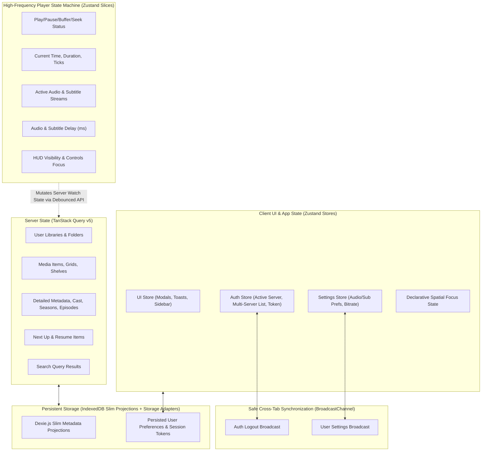

# CineTheme State Architecture Specification

## 1. State Classification Matrix

To maintain predictability, prevent race conditions, and achieve optimal rendering performance, application state in CineTheme is strictly partitioned into distinct categories:



---

## 2. Server State Architecture: TanStack Query v5

All asynchronous data originating from the Jellyfin server is managed via TanStack Query. Detailed server responses (cast, streams, chapters) live exclusively in TanStack Query's volatile memory cache with automatic garbage collection.

### 2.1 Query Key Factory
Query keys follow a deterministic, hierarchical structure to enable surgical cache invalidations:

```typescript
export const queryKeys = {
  all: ['jellyfin'] as const,
  server: (serverId: string) => [...queryKeys.all, 'server', serverId] as const,
  
  // User & Auth
  user: (serverId: string, userId: string) => [...queryKeys.server(serverId), 'user', userId] as const,
  libraries: (serverId: string, userId: string) => [...queryKeys.user(serverId, userId), 'libraries'] as const,
  
  // Media Shelves & Grids
  items: (serverId: string, userId: string, params: Record<string, unknown>) => 
    [...queryKeys.user(serverId, userId), 'items', params] as const,
  
  // Single Item Details
  item: (serverId: string, userId: string, itemId: string) => 
    [...queryKeys.user(serverId, userId), 'item', itemId] as const,
  
  // Shows, Seasons & Episodes
  seasons: (serverId: string, userId: string, seriesId: string) => 
    [...queryKeys.item(serverId, userId, seriesId), 'seasons'] as const,
  episodes: (serverId: string, userId: string, seriesId: string, seasonId: string) => 
    [...queryKeys.seasons(serverId, userId, seriesId), 'season', seasonId, 'episodes'] as const,
  
  // Home Hubs
  nextUp: (serverId: string, userId: string) => [...queryKeys.user(serverId, userId), 'nextUp'] as const,
  resume: (serverId: string, userId: string) => [...queryKeys.user(serverId, userId), 'resume'] as const,
  latest: (serverId: string, userId: string, parentId?: string) => 
    [...queryKeys.user(serverId, userId), 'latest', parentId ?? 'root'] as const,
  
  // Search
  search: (serverId: string, userId: string, query: string) => 
    [...queryKeys.user(serverId, userId), 'search', query] as const,
};
```

---

## 3. Client State Architecture: Zustand Stores

### 3.1 `useAuthStore` (Session & Multi-Server Manager)
```typescript
export interface ServerProfile {
  id: string;
  name: string;
  url: string;
  userId?: string;
  userName?: string;
  accessToken?: string;
  lastConnected: number;
}

interface AuthStore {
  activeServer: ServerProfile | null;
  savedServers: ServerProfile[];
  currentUser: UserProfile | null;
  isConnecting: boolean;
  
  setActiveServer: (server: ServerProfile | null) => void;
  saveServerProfile: (server: ServerProfile) => void;
  removeServerProfile: (serverId: string) => void;
  setCurrentUser: (user: UserProfile | null) => void;
  handleSessionExpired: () => void; // Clears active session, routes to login on 401
  logout: () => void;
}
```

### 3.2 `usePlayerStore` (Media Context & Playback Engine)
```typescript
type PlaybackState = 'IDLE' | 'LOADING' | 'PLAYING' | 'PAUSED' | 'BUFFERING' | 'ENDED' | 'ERROR';

interface PlayerStore {
  // Media Context
  item: MediaItem | null;
  playbackInfo: PlaybackInfoResponse | null;
  activeMediaSource: MediaSourceInfo | null;
  
  // Playback Dynamics
  state: PlaybackState;
  currentTime: number;
  duration: number;
  bufferedTime: number;
  volume: number;
  isMuted: boolean;
  playbackRate: number;
  
  // Track Selection & Synchronization Offsets (Per-Session)
  audioStreams: AudioStream[];
  activeAudioIndex: number;
  subtitleStreams: SubtitleStream[];
  activeSubtitleIndex: number | null; // null = off
  audioDelayMs: number;               // Range: -5000ms to +5000ms
  subtitleDelayMs: number;            // Range: -5000ms to +5000ms
  
  // Anime & Chapter Markers
  introRange: { start: number; end: number } | null;
  outroRange: { start: number; end: number } | null;
  chapters: ChapterInfo[];
  
  // UI / HUD
  isHUDVisible: boolean;
  isSettingsOpen: boolean;
  isSyncMenuOpen: boolean;
  
  // Actions
  loadItem: (item: MediaItem) => Promise<void>;
  play: () => void;
  pause: () => void;
  seek: (seconds: number) => void;
  setVolume: (volume: number) => void;
  setMuted: (muted: boolean) => void;
  setPlaybackRate: (rate: number) => void;
  selectAudioTrack: (index: number) => void;
  selectSubtitleTrack: (index: number | null) => void;
  setAudioDelayMs: (delayMs: number) => void;
  setSubtitleDelayMs: (delayMs: number) => void;
  setHUDVisible: (visible: boolean) => void;
  reset: () => void;
}
```

---

## 4. Cross-Tab Synchronization via BroadcastChannel

Cross-tab synchronization is intentionally constrained to safe application lifecycle events:

```typescript
export const appSyncChannel = new BroadcastChannel('cinetheme_app_sync');

export type AppSyncEvent =
  | { type: 'AUTH_LOGOUT'; serverId: string }
  | { type: 'SETTINGS_CHANGED'; key: string; value: unknown };

// Playback progress, seeking, and active video timestamps are EXPLICITLY EXCLUDED
// from cross-tab synchronization to prevent multi-tab playback collisions.
```

---

## 5. Performance Optimization: High-Frequency State Decoupling

1. **Unsubscribed Scrubber Updating:** Progress slider scrubbers use localized micro-components subscribing strictly to `currentTime` or direct imperative DOM refs.
2. **Ref-based Frame Loops:** JASSUB subtitle rendering and trickplay preview coordinate math query `videoRef.current.currentTime` directly without triggering React component re-renders.
