# CineTheme Subtitle Font Attachment Architecture

## 1. Overview

CineTheme is designed to provide a first-class streaming experience for anime and styled international content. Advanced SubStation Alpha (`.ass` and `.ssa`) subtitles frequently rely on embedded font typography (e.g., custom dialogue typefaces, signage fonts, localized karaoke effects).

This document outlines the font discovery, lazy retrieval, session caching, fallback strategy, security isolation, and lifecycle cleanup for CineTheme's subtitle rendering pipeline.

---

## 2. Jellyfin Font Attachment Model

Jellyfin extracts and exposes font attachments embedded in Matroska (`.mkv`) or MP4 containers as media stream attachments:

### 2.1 Media Source Attachments
When querying `POST /Items/{itemId}/PlaybackInfo`, the returned `MediaSourceInfo` contains:
- `MediaAttachments`: Array of attachment metadata objects:
  - `Index`: Numeric index of the attachment stream (e.g., `0, 1, 2...`).
  - `Name`: Filename (e.g., `Trebuchet_MS.ttf`, `AnimeFont-Bold.otf`).
  - `MimeType`: MIME classification (`font/ttf`, `font/otf`, `font/woff2`, `application/x-font-truetype`, `application/font-sfnt`).
  - `DeliveryUrl`: Relative endpoint path (or constructed via `/Videos/{itemId}/{mediaSourceId}/Attachments/{attachmentIndex}`).

### 2.2 Authenticated Endpoint Contract
```http
GET /Videos/{itemId}/{mediaSourceId}/Attachments/{attachmentIndex}?api_key={token}
```
- **Response Headers:** `Content-Type: font/ttf` (or respective format).
- **Binary Payload:** Raw OpenType (`.otf`), TrueType (`.ttf`), or Web Open Font Format (`.woff`/`.woff2`) data.

---

## 3. Font Loading Lifecycle & State Management

```mermaid
sequenceDiagram
    autonumber
    actor User
    participant SubMenu as Subtitle Menu
    participant Controller as PlayerController
    participant SubEngine as Subtitle Engine
    participant FontMgr as FontManager (Session Cache)
    participant JASSUB as JASSUB libass Worker
    participant Server as Jellyfin Server

    User->>SubMenu: Select ASS/SSA Subtitle Track
    SubMenu->>Controller: setSubtitleTrack(index)
    Controller->>SubEngine: attach(video, subUrl, mediaSource)
    
    rect rgb(20, 20, 30)
    Note over SubEngine,JASSUB: 1. Lazy Wasm Instantiation
    SubEngine->>JASSUB: Dynamically import('jassub')
    SubEngine->>JASSUB: Initialize Worker with Universal Fallback Fonts
    Note over JASSUB: Subtitles begin rendering immediately without frame lag
    end

    rect rgb(30, 25, 40)
    Note over SubEngine,FontMgr: 2. Asynchronous Font Attachment Ingestion
    SubEngine->>FontMgr: discoverAndLoadFonts(itemId, mediaSourceId, token, attachments)
    loop For Each Font Attachment
        FontMgr->>FontMgr: Check in-memory session cache
        alt Cached in Memory
            FontMgr-->>SubEngine: Return cached Blob URL / ArrayBuffer
        else Not Cached
            FontMgr->>Server: GET /Videos/{itemId}/{mediaSourceId}/Attachments/{idx}
            Server-->>FontMgr: 200 OK (ArrayBuffer)
            FontMgr->>FontMgr: Store in session cache
        end
        FontMgr->>JASSUB: worker.addFont(fontName, fontData)
    end
    end
```



---

## 4. Architectural Rules & Guarantees

### 4.1 Zero Playback Startup Blocking
- **No Blocking Await:** Video playback and initial subtitle rendering **NEVER** wait for all font attachments to complete downloading.
- **Universal Fallbacks:** JASSUB initializes with standard system/web typography (Sans-Serif, Arial, Roboto, Open Sans).
- **Runtime Font Hot-Swapping:** As font attachments arrive from the server, `JassubEngine` registers them into the live `libass` font directory, updating rendered glyphs on subsequent subtitle events.

### 4.2 Selective On-Demand Fetching
- Fonts are fetched **ONLY** when an ASS/SSA track is actively selected.
- If the user watches with WebVTT subtitles, SRT subtitles, or Subtitles Off, zero font network requests are dispatched, saving bandwidth on metered and mobile connections.

### 4.3 In-Memory Session Caching
- Font buffers are cached in a session-scoped `Map<string, Uint8Array | Blob>` within `FontManager`.
- When switching between audio tracks or adjusting quality caps within the same media item, cached fonts are reused without re-fetching from Jellyfin.

### 4.4 Graceful 404 / Failure Handling
- If a font attachment returns 404 (Not Found), 500 (Transcode error), or times out, the failure is caught silently.
- The playback stream continues smoothly using fallback typography with zero crashes or error alerts.

### 4.5 Memory Cleanup & Teardown
- Upon closing the player or navigating away, `PlayerController.destroy()` calls `FontManager.clear()`, which:
  - Aborts in-flight font `fetch` operations via `AbortController`.
  - Clears in-memory ArrayBuffer references.
  - Revokes any temporary `URL.createObjectURL` references.
  - Destroys the WebAssembly `JASSUB` worker thread.

---

## 5. Security & Credential Redaction

- Font attachment URLs contain the session `api_key` for HTTP streaming authorization.
- `FontManager` wraps all diagnostic messages and network traces with `redactMediaUrl()`.
- Raw font URLs containing access tokens are never written to `localStorage`, `IndexedDB`, or exposed in client error boundaries.
