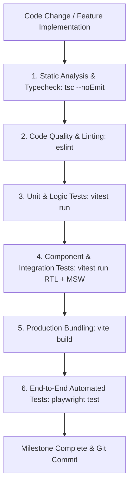

# CineTheme Testing Strategy & Quality Assurance Specification

## 1. Testing Philosophy & Quality Gates

In strict compliance with `AGENTS.md`, no feature or milestone is considered complete unless all quality gates pass cleanly:



---

## 2. Test Pyramid & Breakdown

| Layer | Tooling | Target Scope | Coverage Target |
|---|---|---|---|
| **Unit Testing** | Vitest | Time unit conversions (ticks $\leftrightarrow$ seconds), chapter marker regex, trickplay sprite math, `DeviceProfileBuilder` capability probing, audio/sub sync delay offsets, debounced telemetry timer math. | $> 90\%$ |
| **API Integration** | Vitest + MSW | Jellyfin API client, session 401 revocation handling (no silent refresh), multi-server profiles, query key factory, attachment endpoints. | $> 85\%$ |
| **Component Testing** | React Testing Library + Vitest | Design system components, media cards, focus management & focus traps, player HUD, volume sliders, settings modals. | $> 80\%$ |
| **Player Engine Testing** | Vitest (Mock HTMLMediaElement + MSE) | Direct Play (MP4/WebM) vs Direct Stream (MKV remux/DTS audio transcode) vs Transcoding matrix, debounced seek telemetry, JASSUB fallback fonts. | $> 85\%$ |
| **End-to-End (E2E)** | Playwright | Full browser flows: Server setup $\to$ Login $\to$ Library view $\to$ Media playback $\to$ Resume progress verification. | Key User Journeys |

---

## 3. Real Jellyfin API Mocking Strategy (MSW)

CineTheme never invents fake Jellyfin endpoints or invalid schemas. All test mocks in Mock Service Worker (`msw`) adhere 100% to official Jellyfin OpenAPI 10.8/10.9/10.10 specifications.

### 3.1 MSW Server Handlers Example
```typescript
import { http, HttpResponse } from 'msw';

export const jellyfinHandlers = [
  // Public System Info
  http.get('*/System/Info/Public', () => {
    return HttpResponse.json({
      ServerName: 'CineTheme-Test-Server',
      Version: '10.9.11',
      Id: 'test-server-uuid-1234',
      StartupWizardCompleted: true,
    });
  }),

  // AuthenticateByName
  http.post('*/Users/AuthenticateByName', async ({ request }) => {
    const body = (await request.json()) as { Username: string; Pw: string };
    if (body.Username === 'demo' && body.Pw === 'password123') {
      return HttpResponse.json({
        User: {
          Id: 'user-guid-5678',
          Name: 'DemoUser',
          Policy: { IsAdministrator: false },
        },
        AccessToken: 'mock-access-token-xyz',
        ServerId: 'test-server-uuid-1234',
      });
    }
    return new HttpResponse(null, { status: 401, statusText: 'Unauthorized' });
  }),

  // Attachment Stream Endpoint (Font Attachments)
  http.get('*/Videos/:itemId/:mediaSourceId/Attachments/:index', () => {
    return new HttpResponse(new ArrayBuffer(1024), {
      headers: { 'Content-Type': 'font/woff2' },
    });
  }),

  // PlaybackInfo Negotiation
  http.post('*/Items/:itemId/PlaybackInfo', () => {
    return HttpResponse.json({
      MediaSources: [
        {
          Id: 'source-1',
          Container: 'mkv',
          SupportsDirectPlay: false, // MKV on Web triggers Direct Stream
          SupportsDirectStream: true,
          SupportsTranscoding: true,
          MediaStreams: [
            { Type: 'Video', Codec: 'h264', Index: 0 },
            { Type: 'Audio', Codec: 'dts', Index: 1, Language: 'jpn' },
            { Type: 'Subtitle', Codec: 'ass', Index: 2, Language: 'eng', IsForced: false },
          ],
        },
      ],
      PlaySessionId: 'mock-playsession-999',
    });
  }),
];
```

---

## 4. Automated CI/CD Scripts Configuration

```json
{
  "scripts": {
    "dev": "vite",
    "build": "tsc -b && vite build",
    "lint": "eslint . --max-warnings 0",
    "typecheck": "tsc --noEmit",
    "test": "vitest run",
    "test:watch": "vitest",
    "test:coverage": "vitest run --coverage",
    "test:e2e": "playwright test",
    "verify": "npm run typecheck && npm run lint && npm run test && npm run build"
  }
}
```
*Rule: The `npm run verify` command must pass with zero errors and zero warnings before concluding any task.*
